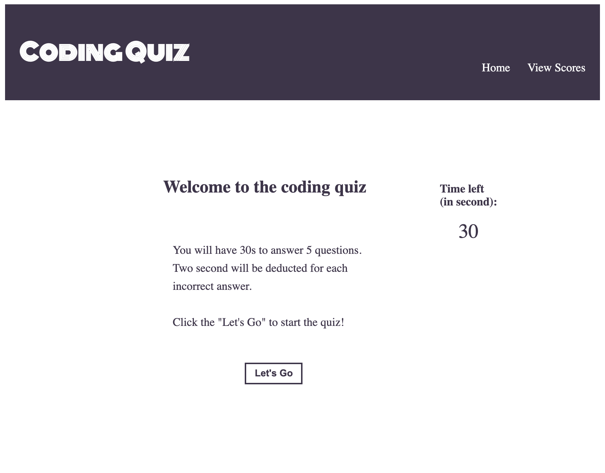

# Daily-Quiz
 
## Purpose
This webpage is used for getting familiarize with coding knowledge on a daily basis. With a limited 30 second of time, this could give user an opportunity to get ready to answer coding questions in a timely manner.

## Rules
User will be giver 30 second to answer 5 coding questions. For each incorrect answer, 2 second will be deducted from the timer.

There are two conditions to complete the quiz:
1. user finished 5 questions within 30s.
2. 30 second is up without finishing all questions.

## To start
To start the quiz by simply pressing the "Let's Go" button.

## Result
Result will shown after usder finish the game. User will be able to log their score with initial each time.

All the logged scores can be viewed from "View Scores"

## Completed Website
 Below is the home page of the quiz website

## Deployed URL
[Access the link here](https://yingliii.github.io/Daily-Quiz/)
